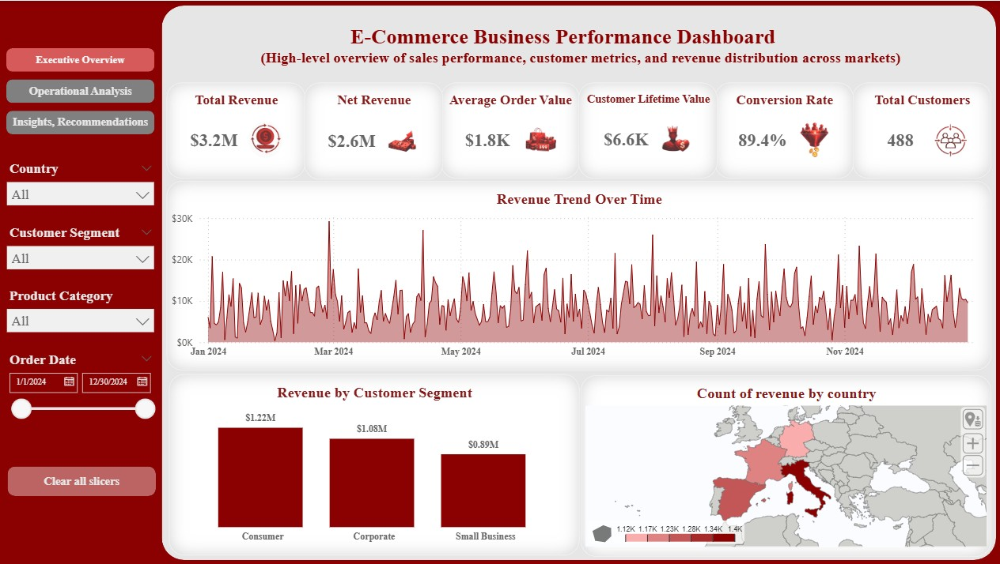
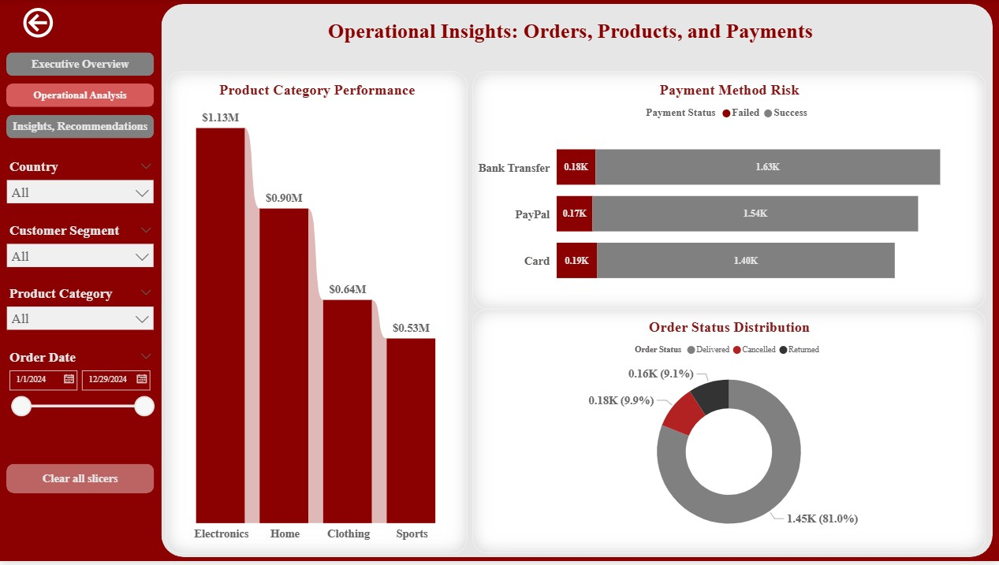
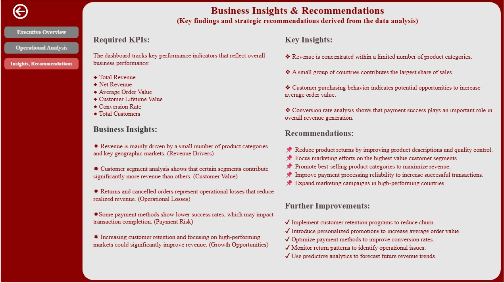

# E-commerce Data Analysis Case Study

## Project Overview

This project simulates a real-world data analytics scenario for an e-commerce company.

The goal of the project is to clean, model, analyze, and visualize transactional data in order to generate meaningful business insights that support data-driven decision making.

The project demonstrates a complete end-to-end data analysis workflow including data preparation, exploratory analysis, SQL querying, KPI engineering, and dashboard development.

The final outcome is an interactive business dashboard that highlights key performance indicators and important operational insights.

---

# Project Objectives

The main objectives of this project are:

- Clean and validate raw business data
- Build a structured analytical dataset
- Perform exploratory data analysis to identify patterns
- Use SQL to answer key business questions
- Create business KPIs used by decision makers
- Develop an interactive dashboard for performance monitoring
- Provide clear business recommendations based on data insights

---

# Dataset Description

The dataset simulates a typical e-commerce transactional system and consists of five relational tables.

### Customers

Contains customer information including:

- Customer ID
- Country
- Customer Segment
- Signup Date

This table helps analyze customer behavior and segmentation.

---

### Products

Contains product catalog information including:

- Product ID
- Product Category
- Product Price

This table is used to analyze product performance and revenue contribution by category.

---

### Orders

Contains order-level information including:

- Order ID
- Customer ID
- Order Date
- Order Status (Delivered, Returned, Cancelled)

This table allows analysis of order lifecycle and operational performance.

---

### Order Items

Contains detailed information about products included in each order.

Fields include:

- Order Item ID
- Order ID
- Product ID
- Quantity

This table connects products with individual orders.

---

### Payments

Contains payment transaction information including:

- Payment ID
- Order ID
- Payment Method
- Payment Status (Success / Failed)

This table allows analysis of payment reliability and conversion rates.

---

# Data Quality Issues

The dataset intentionally includes several real-world data issues to simulate practical analytics challenges.

Examples include:

- Missing values in customer country
- Duplicate records in orders
- Returns and cancelled orders
- Failed payments
- Data type inconsistencies

These issues were addressed during the data cleaning stage.

---

# Data Cleaning

Data cleaning was performed using Python and Pandas.

The following steps were completed:

- Handling missing values in the `country` column
- Removing duplicate orders
- Converting date columns to proper datetime format
- Validating relationships between tables
- Checking for invalid product references
- Ensuring consistent data types across datasets

After cleaning, all datasets were saved as clean CSV files for further analysis.

---

# Data Modeling

To support analysis, a final analytical dataset was created by joining the main tables.

The following relationships were used:

Customers → Orders
Orders → Order Items
Products → Order Items
Orders → Payments

Additional calculated fields were added:

- **Revenue** = Quantity × Product Price
- **Valid Order Flag** = Delivered orders with successful payments

The resulting dataset serves as the primary analytical table used throughout the project.

---

# Exploratory Data Analysis (EDA)

Exploratory Data Analysis was performed using Python to understand trends and patterns in the data.

Key analyses include:

- Revenue trends over time
- Revenue by country
- Revenue by customer segment
- Product category performance
- Order status distribution (Delivered / Returned / Cancelled)
- Payment success rate

Visualizations were created to highlight important business insights and potential operational issues.

---

# SQL Analysis

SQL queries were used to answer important business questions and simulate real-world data warehouse analysis.

The final analytical dataset was loaded into a SQLite database and queried using SQL.

Examples of analytical queries include:

- Top 10 customers by total revenue
- Revenue by product category
- Monthly revenue growth
- Cancellation rate by country
- Payment success rate by payment method

This step demonstrates the ability to use SQL for structured business analysis.

---

# KPI Engineering

Several key business performance indicators were created to measure company performance.

The KPIs include:

### Total Revenue

Total sales generated from all valid orders.

---

### Net Revenue

Revenue excluding returned and cancelled orders.

This metric reflects the actual realized revenue.

---

### Average Order Value (AOV)

Average revenue generated per order.

AOV helps measure customer purchasing behavior.

---

### Customer Lifetime Value (CLV)

A basic estimation of the total revenue generated by each customer across all orders.

---

### Churn Proxy

Customers who have not placed orders within a defined time window are considered inactive.

This helps estimate customer churn behavior.

---

### Conversion Rate

Percentage of successful payments compared to total payment attempts.

This metric measures how efficiently orders are converted into completed transactions.

---

# Dashboard

An interactive dashboard was created to visualize business performance and support decision making.

The dashboard provides a high-level overview of company performance and allows users to explore the data interactively.

Main dashboard components include:

- KPI summary cards
- Revenue trend analysis
- Product category performance
- Customer segmentation insights
- Country level performance
- Returns and cancellations analysis
- Payment method reliability

---

# Dashboard Filters

The dashboard allows users to filter the data by:

- Date
- Country
- Customer Segment
- Product Category

These filters allow flexible analysis of business performance across different dimensions.

---

# Business Questions Answered

This project addresses several key business questions.

### What drives revenue?

Revenue drivers were analyzed by country, customer segment, and product category.

---

### Which customer segment is most valuable?

Customer segments were compared based on total revenue contribution.

---

### Where are losses happening?

Returns and cancelled orders were analyzed to identify operational losses.

---

### Which payment methods are risky?

Payment success rates were evaluated to identify unreliable payment methods.

---

### What should the company improve?

Insights from the analysis provide recommendations for improving operational efficiency, reducing losses, and increasing revenue.

---

# Tools & Technologies

Python
Pandas
NumPy
Matplotlib
Seaborn
SQL
SQLite
Power BI

---

# Project Structure


## Project Structure

```text
ECOMMERCE-DATA-AANALYSIS-CASE-STUDY/
│
│
├── Assets/
│   ├── executive_overview.jpg
│   │
│   ├── insights_recommendations.jpg
│   │
│   └── operational_analysis.jpg
│       
│
├── Data/
│   ├── customers.csv
│   │
│   ├── customers_clean.csv
│   │
│   ├── orders.csv
│   │
│   ├── orders_clean.csv
│   │
│   ├── order_items.csv
│   │
│   ├── payments.csv
│   │
│   ├── products.csv
│   │
│   └── Final_Dataset.csv
│       
│
├── Notebooks/
│   ├── 01_Data_Cleaning.ipynb 
│   │
│   ├── 02_Data_Modeling.ipynb
│   │
│   ├── 03_EDA_Analysis.ipynb
│   │
│   └── 04_KPI_Engineering.ipynb
│
├── Power-BI-Dashboard/
│   └── E-Commerce Dashboard.pbix
│
├── SQL/
│   ├── 05_SQL_Analysis.ipynb
│   │
│   └── E-Commerce.db
│
└── Data_Script.py
```

---

# Dashboard Preview

## Executive Overview




---

## Operational Analysis




---

## Insights & Recommendations




---

# Key Outcome

This project demonstrates the ability to perform an end-to-end data analytics workflow including:

- Data cleaning and preparation
- Data modeling and relational analysis
- Exploratory data analysis
- SQL based business analysis
- KPI engineering
- Dashboard development
- Business insight generation

The project highlights practical analytical skills required for real-world data analyst roles.
